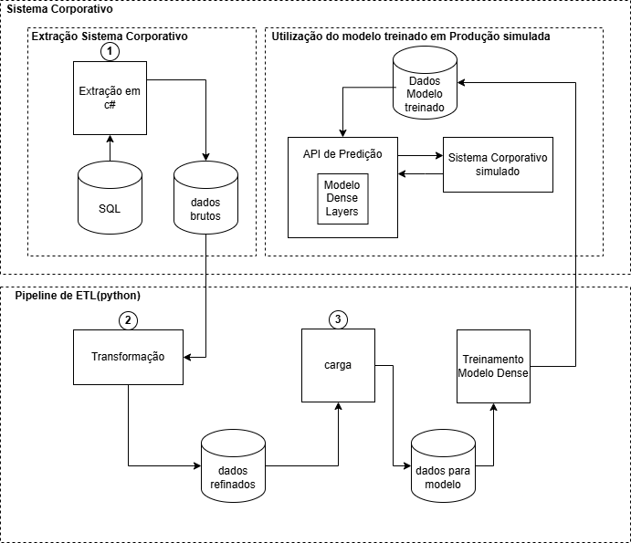

## Tech Challenge Fase 3 - FIAP - 4MLET

Este repositório foi criado como parte da entrega do **Tech Challenge da Fase 3** da **Pós-Graduação em Machine Learning Engineering - Pós Tech - 4MLET**, promovida pela **FIAP**.

O projeto foi desenvolvido com base no **Tech Challenge**, atividade integradora que visa consolidar os conhecimentos adquiridos ao longo da formação, por meio da criação de uma solução completa de **Machine Learning Engineering**. O desafio propõe o desenvolvimento de um sistema que englobe a **coleta e preparação de dados**, o **armazenamento estruturado** dessas informações, a **modelagem preditiva**, o **versionamento e documentação do código** em repositório público e a apresentação de um **modelo funcional**, capaz de alimentar uma aplicação ou dashboard.

Neste contexto, foi concebida a implementação de uma solução para a **previsão de próximos casos de uso em sistemas corporativos**, explorando técnicas de aprendizado supervisionado e arquiteturas de redes neurais aplicadas ao processamento de sequências, com o objetivo de demonstrar a capacidade de integração entre engenharia de dados, modelagem estatística e entrega de valor através de produtos de machine learning.

Como pode ser observado ao longo deste storytelling, inicialmente imaginamos que este seria um problema de **predição de sequencia**.  Contudo, após análises e testes, percebemos que o tamanho reduzido de sequencias utilizadas para o aprendizado acaba por tornando o problema mais de **classificação multiclasse**.  Tal fato nos levou a iniciar os testes implementado um modelo LSTM e concluimos o trabalho com um modelo Dense Layers.  Mantivemos os dois, já que se trata de um trabalho académico.

# Previsão de Próximos Casos de Uso no Sistema Corporativo

## Descrição do Projeto
Este projeto tem como objetivo a construção de um modelo de Machine Learning capaz de **prever os próximos casos de uso** que um usuário do sistema corporativo provavelmente irá executar, com base no **histórico de interações** registrado nos logs do sistema.

A motivação principal é **antecipar comportamentos**, permitindo otimizar processos, melhorar a experiência do usuário e fornecer subsídios para decisões estratégicas, como sugestões automatizadas ou alocação de recursos.

O modelo foi treinado utilizando uma **Rede Neural** com arquitetura baseada em camadas **Dense** e função de ativação **Softmax**, após testes comparativos com arquiteturas de LSTM. O pipeline do projeto envolve desde a extração dos dados diretamente do banco do sistema até o deploy do modelo para utilização prática, que será demonstrada através de um **protótipo simulando o sistema corporativo chamando a API**, visto a impossibilidade de se abrir o sistema real neste trabalho.  O treinamento e utilização do modelo LSTM foram mantidos como opção, apenas para efeito de comparação.

## Arquitetura do Projeto
O projeto foi estruturado em um pipeline de **cinco etapas principais**, integrando as diversas fases do desenvolvimento de soluções baseadas em Machine Learning:

1. **Extração:** Coleta dos dados de logs de uso diretamente do banco de dados do sistema corporativo e exportação para arquivos no formato `.CSV`.
2. **Transformação:** Processamento e limpeza dos dados, com remoção de inconsistências, **anonimização de informações sensíveis** e preparação das sequências de entrada para o modelo.
3. **Modelagem:** Desenvolvimento e treinamento de modelos preditivos baseados em redes neurais. Após testes comparativos, optou-se por uma **arquitetura Dense com função Softmax**.
4. **Validação:** Avaliação do modelo com métricas adequadas, buscando equilíbrio entre desempenho e eficiência.
5. **Deploy:** Disponibilização do modelo treinado por meio de uma **API**, que será consumida por um **protótipo simulando o sistema corporativo**, validando a aplicabilidade prática da solução.



## ETL - Extração, Transformação e Carga

### 1. Extração
Os dados utilizados neste projeto foram extraídos diretamente do **banco de dados transacional** do sistema corporativo, onde são registrados os logs de uso dos usuários.

A extração foi realizada utilizando-se **.NET C#** com o **framework ObjetoRelacional da DevExpress (XPO)**, que é amplamente utilizado corporativamente nos sistemas da empresa. Esta escolha garantiu total integração e compatibilidade com as infraestruturas e práticas já estabelecidas.

Além da extração dos dados brutos, nesta etapa também foram realizadas:
- A **exclusão de casos de uso considerados irrelevantes** para a modelagem.
- A **anonimização dos usuários**, substituindo os identificadores reais por códigos alfanuméricos gerados automaticamente.

As informações extraídas foram:
- **Identificação do usuário** (anonimizada).
- **Data e hora** da execução.
- **Identificador do caso de uso** realizado.
- **Periodo do mês** em que a execução ocorreu (antes_folha, dia_folha ou apos_folha).

O resultado foi exportado para um arquivo `.CSV`, facilitando o processamento subsequente.

### Sobre o Parâmetro Periodo do Mês
Além das variáveis representando a sequência de casos de uso, foi incorporado ao modelo o parâmetro **periodo_mes**, que representa o momento do mês em que a interação ocorreu (antes_folha, dia_folha ou apos_folha). Esta variável foi introduzida com base na observação de que o conjunto de casos de uso mais comuns varia significativamente conforme o período do mês, podendo afetando diretamente o comportamento dos usuários e, consequentemente, a acurácia das previsões.

Este parâmetro foi tratado de forma diferenciada durante o treinamento do modelo, uma vez que não **representa uma sequência de ações**, mas sim uma **característica contextual do momento da interação**. Assim, enquanto a sequência de casos de uso foi modelada como variáveis categóricas transformadas para representar a ordem dos eventos, o **periodo_mes** foi incorporado como um **atributo independente**, que influencia o padrão de comportamento, mas **não depende da ordem sequencial** dos casos de uso.

Para integrar essa informação ao modelo, o **periodo_mes** foi convertido em uma variável numérica representando as categorias (**antes_folha, dia_folha, apos_folha**), normalizada adequadamente e fornecida como **entrada adicional** ao modelo, em paralelo às sequências. Dessa forma, o modelo consegue ajustar suas previsões conforme o contexto temporal, sem confundir essa variável com as sequências que compõem o histórico de uso.

### 2. Transformação
A etapa de transformação foi realizada no ambiente de **Python**, utilizando as bibliotecas **Pandas** e **NumPy**.

As principais ações realizadas foram:
- **Limpeza:** Remoção de registros inconsistentes ou incompletos.
- **Estruturação das Sequências:** Organização dos dados em **sequências temporais** por usuário ou não (foram realizados testes por usuário e decidido não considerar o usuário no treino).

### 3. Carga
Os dados transformados foram carregados no ambiente de desenvolvimento em **Python**, utilizando principalmente as bibliotecas:
- **Pandas**
- **NumPy**
- **Scikit-learn**

## Modelagem
A modelagem do projeto teve como objetivo construir um modelo capaz de prever, a partir de uma sequência de interações anteriores de um usuário com o sistema, qual será o **próximo caso de uso** mais provável.

Foram realizados **testes comparativos** com:
- **LSTM**
- **Rede Neural com Camadas Dense e Softmax**

Também foi considerada a possiblidade de realizar um treino para cada usuário, o que geraria um modelo por usuário. Tal abordagem poderia se mostrar vantajosa, considerando que usuários distintos realizam operações próprias no sistema, de acordo com suas funções.  Porém, alguns testes mostraram que seria melhor gerar um treino único, para todos os usuários. Alguns usuários apresentam uma quantidade muito baixa de amostras.

Os arquivos presentes na pasta treinamento/saidas demonstram alguns testes realizados com a variação de modelo e também uma avaliação da viabilidade de se treinar um modelo para cada usuário.

Após testes, a arquitetura baseada em **camadas Dense com função de ativação Softmax** foi escolhida. O treinamento foi realizado com as **amostras de todos os usuários**, excetuando-se apenas alguns com utilizações muito restritas de casos de uso e que não colaboravam com o treinamento.

### Tecnologias utilizadas:
- **Python**
- **TensorFlow/Keras**

## Considerações sobre a Comparação entre LSTM e Dense
Durante o processo de modelagem, realizamos **testes comparativos** entre arquiteturas baseadas em **LSTM (Long Short-Term Memory)** e uma rede **Dense Layers com função de ativação Softmax**. Embora o LSTM seja uma escolha clássica para problemas envolvendo **sequências temporais**, neste contexto específico ele apresentou desempenho inferior. As principais razões identificadas para esse resultado foram:

### 1. Tamanho e complexidade das sequências
- O histórico de interações analisado continha **sequências relativamente curtas (2 casos de uso como histórico para cada previsão)** e com **pouca variabilidade temporal** complexa, características para as quais a arquitetura LSTM foi **subaproveitada**.
- Modelos LSTM são mais vantajosos em **contextos onde existe dependência de longo prazo** ou **padrões temporais complexos**, o que não se evidenciou neste dataset.

### 2. Overfitting
- Devido à sua **maior complexidade** e ao número superior de parâmetros, a LSTM demonstrou uma **tendência maior ao overfitting**, principalmente dado o tamanho limitado do conjunto de dados disponível.
- Mesmo com regularização, como dropout e ajustes nos hiperparâmetros, o modelo LSTM apresentou **piora na generalização**. 

### 3. Eficiência e Simplicidade
- A arquitetura com **camadas Dense** foi capaz de capturar os **padrões relevantes** das sequências de uso de forma mais **eficiente e simples**.
- Além disso, apresentou uma **inferência mais rápida** e com **menor custo computacional**, o que é altamente relevante para aplicações práticas que exigem **baixa latência**.

### 4. Natureza do problema
- O problema de previsão do **próximo caso de uso** se comportou de maneira mais próxima de uma **classificação categórica sobre um espaço de estados discretos**, onde modelos como Dense se adequam muito bem, sem a necessidade de um mecanismo explícito de memória de longo prazo como o fornecido pelo LSTM.

## Treinamento e Validação
- **Divisão dos dados:** treino, validação e teste.
- **Hiperparâmetros:** épocas, batch size, função de perda categórica, otimização com Adam.
- **Métricas:** Acurácia e Top-K Accuracy.
  
## Deploy
O modelo foi exportado gerando:
- Um arquivo **`modelo.keras`**.
- Arquivos **`.pkl`** com objetos auxiliares.

Como foram mantidos tanto os modelos LSTM como Dense Layers, houve a exportação para os dois modelos.  **O protótipo foi implementado utilizando-se o modelo Dense Layers**, que foi escolhido para a utilização prática.  Uma simples alteração no parâmetro `use_lstm` na inicialização da classe ModeloParaUso utilizada pela API possibilita a utilização do modelo LSTM, para efeito comparativo.

Uma **API REST** foi desenvolvida com **FastAPI**, que:
- Recebe uma **sequência de 2 casos de uso** e o **periodo do mês** como entrada.
- Retorna os **`n` casos de uso mais prováveis** como próxima opção do usuário.

A utilização prática foi demonstrada com um **protótipo** que simula o sistema corporativo.

## Como Executar o Projeto

### Requisitos

#### Software Base
- **Python 3.x** (recomendado 3.9 ou superior)
- **pip** (gerenciador de pacotes Python)

#### Pacotes Python
Todos os pacotes abaixo serão instalados automaticamente via `requirements.txt`:
- **Pandas**: Manipulação de dados
- **NumPy**: Operações numéricas
- **Scikit-learn**: Pré-processamento de dados
- **TensorFlow/Keras**: Modelos de deep learning
- **FastAPI**: API REST
- **Uvicorn**: Servidor ASGI

### Passos
1. Clonar o repositório:
```bash
# git clone git@github.com:fabiomatos71/fiap_4MLET_fase3.git tc_fase3_grupo25
# cd tc_fase3_grupo25
```

2. Criar e configurar o ambiente virtual:
```bash
# python -m venv .venv              # Criar ambiente virtual
# source .venv/bin/activate         # Ativar ambiente virtual (Linux/Mac)
# .venv\Scripts\activate            # Ativar ambiente virtual (Windows)
# pip install -r requirements.txt   # Instalar dependências
```

3. Executar a API em um terminal novo:
```
# source .venv/bin/activate
# uvicorn api.principal:app --reload --host 0.0.0.0 --port 8000
```
4. Executar o protótipo em outro terminal:
```
# source .venv/bin/activate
uvicorn inferencia.app:app --reload --host 0.0.0.0 --port 8001
```
5. Acessar a interface web em:
http://localhost:8001

### Problemas Comuns

#### Erro ao criar ambiente virtual
Se você encontrar erros ao criar o ambiente virtual, certifique-se de que:
1. Python 3.x está instalado e acessível via linha de comando:
   ```bash
   python --version  # ou python3 --version
   ```
2. O módulo venv está instalado:
   - Ubuntu/Debian: `sudo apt-get install python3-venv`
   - Fedora: `sudo dnf install python3-venv`
   - Windows: Já vem instalado com Python 3.x

#### Erro ao instalar dependências
Se houver erros ao executar `pip install -r requirements.txt`:
1. Certifique-se de que o ambiente virtual está ativado (deve aparecer `(.venv)` no prompt)
2. Atualize o pip: 
   ```bash
   python -m pip install --upgrade pip
   ```
3. Instale as dependências uma a uma se necessário:
   ```bash
   pip install pandas numpy scikit-learn tensorflow fastapi uvicorn
   ```

#### Erro ao executar a API ou interface web
Se encontrar erros como "porta já em uso":
1. Certifique-se de que nenhum outro processo está usando as portas 8000 e 8001
2. Você pode mudar as portas usando `--port` ao executar o uvicorn
3. Lembre-se de que precisa ter dois terminais abertos, um para a API e outro para a interface

### Para realizar o treino novamente
1. Clonar o repositório
2. Configurar o ambiente
3. Executar **treinamento/treina_dense_layers.py**.  (Isso atualiza o modelo na pasta **modelos/**)

## Resultados
Embora a **acurácia global** do modelo, medida sobre a base de teste, tenha apresentado um valor relativamente *baixo (em torno de 28%)*, é importante contextualizar esse resultado na natureza do problema e na forma como a solução será utilizada.

O modelo foi projetado para retornar os **5 casos de uso mais prováveis** (Top-5) para cada sequência de entrada. Dessa forma, **a previsão não precisa necessariamente indicar o próximo caso de uso na primeira posição**, mas sim apresentar um conjunto de opções relevantes para o usuário ou para o sistema automatizado que consome essas previsões.

Essa abordagem torna a solução **muito mais útil e "acertiva" na prática**, pois, ao incluir o caso desejado entre as principais sugestões, ela **melhora significativamente a experiência do usuário**, mesmo que a precisão tradicional da classificação (em acerto exato) seja mais modesta.

Portanto, a validação prática demonstrou que, apesar dos desafios inerentes ao dataset e à complexidade do comportamento dos usuários, a solução é **efetiva e viável**, reforçando a sua **aplicabilidade no contexto corporativo**.

A validação prática reforçou a **viabilidade de integração** da solução.

## Autor
Este projeto foi desenvolvido por:

**Grupo25: Fábio Vargas Matos**
- E-mail: fabio.vargas.matos@gmail.com
- GitHub: [https://github.com/fabiomatos71](https://github.com/fabiomatos71)


## Estrutura de Diretórios

O projeto está organizado da seguinte forma para garantir clareza, modularidade e facilidade de manutenção:

```
/
├── api/                        # API para previsões usando o modelo treinado
│   └── principal.py           # Implementação da API FastAPI para previsões
│
├── dados/                     # Dados do projeto
│   ├── brutos/               # Dados brutos extraídos do sistema
│   │   ├── Dados_TechChallenge_Fase3_bruto.csv    # Dados brutos em CSV
│   │   └── ObterLogsSistema.cs                     # Script C# para extração
│   └── processados/          # Dados após processamento
│       └── Dados_TechChallenge_Fase3.csv          # Dados limpos e processados
│
├── fase3_fiap_4mlet/         # Pacote principal do projeto
│   ├── __init__.py          # Inicializador do pacote
│   ├── modelo_para_uso.py   # Classe para uso do modelo em produção
│   └── treino.py           # Scripts de treinamento dos modelos
│
├── inferencia/              # Aplicação web para simulação do sistema
│   ├── app.py             # Servidor FastAPI para a interface web
│   ├── static/           # Arquivos estáticos da aplicação web
│   │   ├── script.js    # JavaScript para interatividade
│   │   └── style.css   # Estilos CSS da interface
│   └── templates/      # Templates HTML
│       └── index.html # Página principal da aplicação
│
├── modelos/           # Modelos treinados e artefatos
│   ├── modelo-dense.keras     # Modelo Dense treinado
│   ├── modelo-lstm.keras      # Modelo LSTM treinado
│   ├── ohe_x-dense.pkl       # One-Hot Encoder para features (Dense)
│   ├── ohe_x-lstm.pkl        # One-Hot Encoder para features (LSTM)
│   ├── ohe_y-dense.pkl       # One-Hot Encoder para labels (Dense)
│   ├── ohe_y-lstm.pkl        # One-Hot Encoder para labels (LSTM)
│   ├── scaler_epoca-dense.pkl # Scaler para época (Dense)
│   ├── scaler_epoca-lstm.pkl  # Scaler para época (LSTM)
│   ├── scaler_seq-dense.pkl   # Scaler para sequências (Dense)
│   └── scaler_seq-lstm.pkl    # Scaler para sequências (LSTM)
│
├── notebooks/                  # Jupyter notebooks para análise
│   ├── analise_usuarios.ipynb # Análise do comportamento dos usuários
│   └── treino_modelos.ipynb   # Desenvolvimento e treino dos modelos
│
├── requirements.txt           # Dependências do projeto
├── README.md                 # Documentação principal do projeto
└── ESTRUTURA_PROJETO.txt     # Este arquivo
```

## Descrição dos Componentes Principais

1. API (api/)
   - Implementa a interface REST para fazer previsões usando o modelo treinado
   - Utiliza FastAPI para expor o endpoint de previsão

2. Dados (dados/)
   - Contém tanto os dados brutos quanto os processados
   - Inclui o script C# usado para extrair dados do sistema corporativo

3. Pacote Principal (fase3_fiap_4mlet/)
   - Contém a lógica central do projeto
   - Implementa classes para treinamento e uso do modelo em produção

4. Interface Web (inferencia/)
   - Simula o sistema corporativo consumindo a API
   - Interface interativa para demonstrar o funcionamento do modelo
   - Permite selecionar casos de uso e visualizar previsões

5. Modelos (modelos/)
   - Armazena os modelos treinados (Dense e LSTM)
   - Inclui artefatos necessários para pré-processamento

6. Notebooks (notebooks/)
   - Contém análises exploratórias
   - Documenta o processo de desenvolvimento dos modelos
